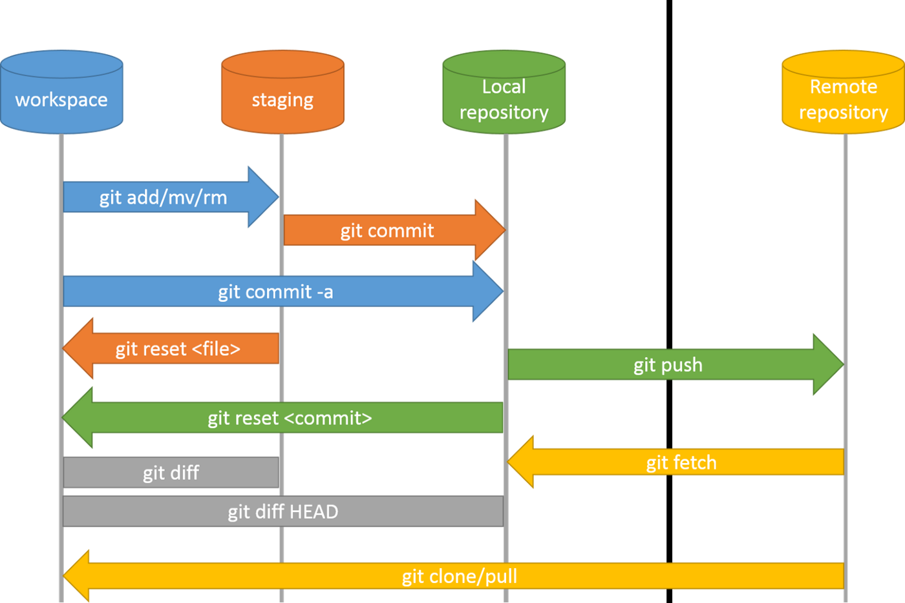

# Getting Started

### Set-up User
Before anything, set up user information in the terminal(macOS)
```
$ git config --global user.name "USERNAME" # Sets username for ALL repositories
$ git config --global user.name # Checks if you did it correctly

$ git config --global user.email "USEREMAIL" # Sets email for ALL repositories
$ git config --global user.name # Checks if you did it correctly
```

### Set-up Repository
Next, we will initialize git on the local machine and connect it to the remote repository. First, set up a remote repository on GitHub(self-explanatory).

`cd` to your desired directory and initialize git.

```
$ cd ~/YOUR_PATH
$ git init
```

Add your remote repository using the HTTPS link found on the interface of your remote repository. Then clone it into the local repository.

```
$ git remote add CHOOSE_A_NAME LINK_TO_REMOTE_URL
$ git clone
```

That is it! This is a bare bones set up so refer to [here](https://docs.github.com/en/get-started/getting-started-with-git/setting-your-username-in-git) for more details.

This was a helpful image that explained the uses of terminal commands for local-remote interaction. It was found on [*"Github" fundamentals (Clone, Fetch, Push, Pull, Fork, Open Source)*](https://medium.com/@mehulgala77/github-fundamentals-clone-fetch-push-pull-fork-16d79bb16b79) by Mehul Gala.

